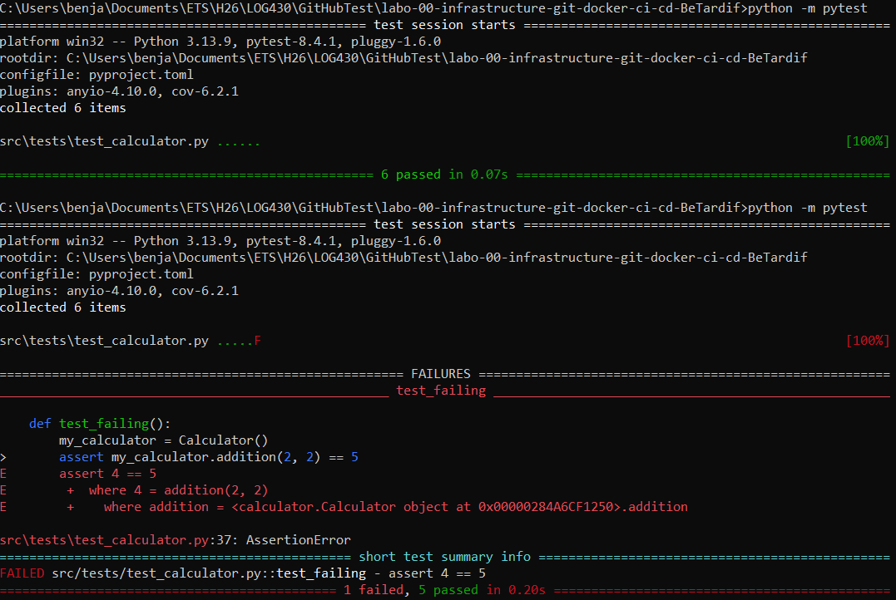
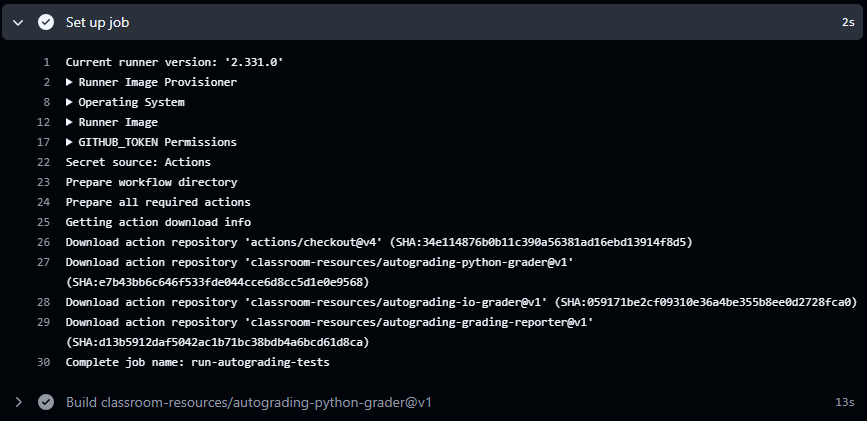
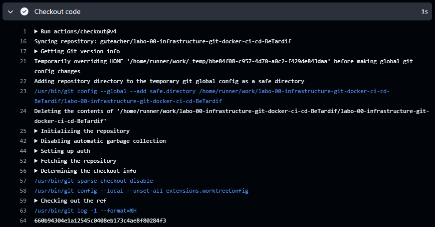
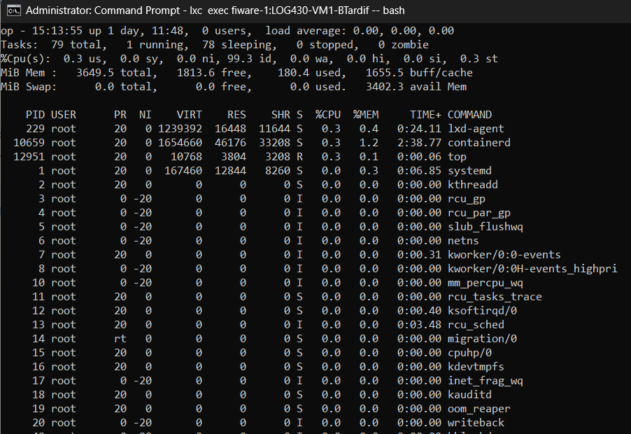

# Laboratoire 0 - Infrastructure (Git, Docker, CI/CD)  
**Table des matières**
1. Introduction, description des fichiers et définition.
2. Réponse aux question.

## 1. Introduction, description des fichiers et définitions.

### Context et introduction ###
**Veuillez noter que que mon compte GitHub scolaire, celui avec inscrit à l'adresse benjamin.tardif.1@ens.etsmtl.ca n'est pas disponible pour l'instant. Mon compter a été hacké cet été et GitHub m'a bloqué l'accès. Les démarches ont été entreprises pour retrouver les droits d'accès. Conséquemment, le repertoire de GitHUb Classroom a été recopié de manière locale afin de pouvoir produire les demandes de laboratoire.**

Ce laboratoire est le premier d'une suite de laboratoire donné dans le cadre du cour LOG430 - architecture logiciel. Il a pour objectif d'apprendre à l'étudiant les notions de base en terme d'infrastructure de développement logiciel, plus précisément
concernant l'environnement GIT, la virtualisation avec Docker et le CI/CD typiquement utilisé en DevOps.

### Objectifs du laboratoire ###
Tel que décrit dans l'énoncé du laboratoire. 
- Apprendre à créer un projet **Python** conteneurisé avec **Docker** à partir de zéro.
- Apprendre à écrire et exécuter des tests automatisés avec **pytest**.
- Mettre en place un pipeline **CI/CD** avec les ressources à notre disposition.

### Definitions ###
* LXD: Lightweight open source virtualisation. Permet de créer et gérer des composantes virtuelles sur une machine.
* LXC: Conteneur ou machine virtuelle permettant une virtualisation.
* Docker: Permet de déployer une application en faisant abstraction du système opératif d'un ordinateur. Docker crée un conteneur dans lequel toutes les dépendances d'une application sont insérées en passant du hardware jusqu'aux modules de dépendances.
* Choco : Gestionnaire de paquets pour windows.

### Description des fichiers ###
**Fourni par le laboratoire :** 
* Dockerfile  
    Sert à définir les attributs du conteneur Docker. Un conteneur contient les éléments et composantes essentiels au fonctionnement d'une application. Une application contenue dans un conteneur peut être déployée sur tout ordinateur sans considération du système opératif de celui-ci. 
* docker-compose.yml  #
    Indique à docker comment construire le conteneur Docker.

**À produire :**
* requirement.txt  
    Définie la liste des dépendances python du projet.
* .env  
    Définie les variables dans une instance de l'application.

## 2. Réponses aux questions.

### Question 1 ###
**Si l'un des tests échoue à cause d'un bug, comment pytest signale-t-il l'erreur et aide-t-il à la localiser ? Rédigez un test qui provoque volontairement une erreur, puis montrez la sortie du terminal obtenue.**

**Réponse :** La capture d'écran présentée tient à démontrer la comparaison entre une suite de test qui échoue et une qui réussie. Elle tient aussi à expliquer comment pytest signale les erreurs des tests qui n'ont pas passés. Comme c'est représenté, Pytest démontre exactement à quelle ligne l'erreur se trouve en plus de montrer un code snippet qui indique le test qui a échoué.

### Question 2 ###
**Que fait GitHub pendant les étapes de « setup » et « checkout » ? Veuillez inclure la sortie du terminal GitHub CI dans votre réponse.**

**Réponse :** Dans le fichier *./.github/workflows/ci.yml* nous avons listé des actions à produire le *continuous integration (CI)* de notre programme. C'est dans ce fichier que nous intégrons une suite de tests à produire automatiquement lors des commandes indiquées. Dans notre cas, ce sont les commandes *Push* et *Pull_Request*. La question demande ce que fait GitHub lors de deux étapes du processus que nous avons mis en place, le setup et le checkout. La première, le setup, est l'étape initiale par laquelle GitHub prépare le travail à faire. C'est lors de cette étape que les authentifications sont produites. Les ressources sont téléchargées et l'environnement est préparé pour le reste des actions mentionnées.
Ensuite, GitHub construit l'environnement pour arriver à la deuxième étape demandée dans la question, le checkout : 
Dans ce *Checkout* github regarde les modifications à apportées à l'application afin qu'elle soit à jour avec code nouvellement publié. On peut le voir à partir de la ligne 52 de la capture d'écran présentée. 

### Question 3 ###
**Quel type d'informations pouvez-vous obtenir via la commande `top` ? Veuillez donner quelques exemples. Veuillez inclure la sortie du terminal dans votre réponse.**
La commande **top** nous permet d'obtenir l'information concernant l'utilisation du CPU de la VM. Tel qu'il est démontré dans la capture d'écran ci-dessous, les lignes décrivent les éléments qui utilisent le CPU. Par exemple, la deuxième ligne est celle du conteneur docker nommé *containerd*, elle utilise 0.3% de l'attribution émise lors de l'étape cinque du laboratoire quand nous avons initié la machine virtuelle. Un autre exemple serait la première ligne qui indique l'agent LXD qui permet la virtualisation. Celle command utilise aussi 0.3% de la capacité du CPU.

